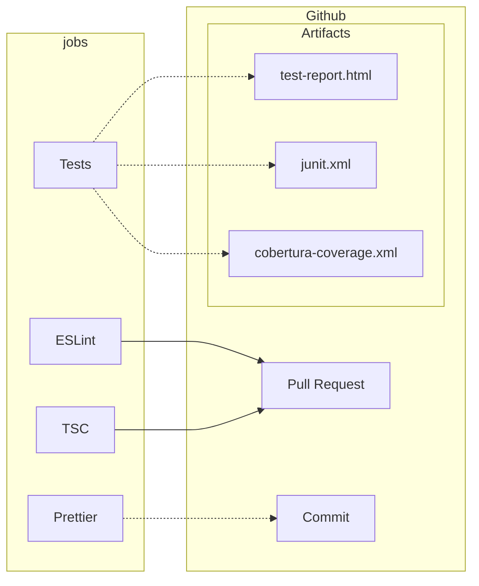

import Description from "@site/src/components/workflow/Description";
import Usage from "@site/src/components/workflow/Usage/Usage.mdx";
import Details from "@site/src/components/workflow/Details/Details.mdx";
import ScreenShots from "@site/src/components/ScreenShots";

# NodeJS Quality

{/* AUTOGENERATED: Description component with badge for lifecycle status */}

<Description
  status={frontMatter.status}
  description={frontMatter.description}
  tags={frontMatter.tags}
  screenshots={frontMatter.screenshots}
/>

## Purpose

This workflow is essentially a quality and style check for a NodeJS project.

It uses ESLint to run checks for problems with your code, prettier to format your code and then a
job that will execute your tests. For typescript projects, it will also run the typescript compiler
to check for type errors.

{/* AUTOGENERATED: Component generating minimal example and input / secret / output lists */}

<Usage workflow={frontMatter.workflow} version={frontMatter.version} />

## Configuration Notes

:::info

The workflow itself will not provide the scripts and dependencies. It simply executes your commands
and provide artifacts if the appropriate dependencies are installed and configured.

:::

### Build authentication

Secrets are provided for build-time authentication with private package registries such as
Artifactory, NPM etc.

There are options to provide an `auth-token` and/or `auth-token-2` where the environment variable
they are exposed as is configurable.

For example you could expose `auth-token: NPM_TOKEN=${{ secrets.SOME_SECRET }}` or
`auth-token: ARTIFACTORY_AUTH_TOKEN=${{ secrets.SOME_SECRET }}` depending on what your build process
requires.

### ESLint

By default the ESLint job utilises an action from
[reviewdog](https://github.com/reviewdog/reviewdog).

To use your own ESLint script, set the eslint-command input to anything you like (e.g. `yarn
lint:ci) and your command will be used instead of reviewdog.

Reviewdog offers different "reporters" to provide feedback on your code. The default reporter is
`github-check` which works for both `push` and `pull_request` events. It provides any findings in
the summary of the workflow as well as in the logs of the job itself.

The `github-pr-check` works in a similar way, but only for `pull_request` events.

The final option `github-pr-review` which provides review comments on the pull request itself. This
is of course only available for `pull_request` workflows.

### Prettier

Executes any prettier command including the option to write the changes back to the files. If you
want the job to commit those changes back to the branch, set the `prettier-commit` input to true.

### Unit Tests

Executes any arbitrary test command(s). If those commands/scripts produce test or coverage reports
then they can be published as artifacts. See [configuration tips](#tips-for-script-configuration)
below.

## Additional Examples

### Disable specific jobs

For example, for non-typescript projects you can disable the tsc job:

```yaml
node-quality:
  uses: erzz/toolbox/.github/workflows/node-quality.yml@v1
  with:
    tsc-enable: false
```

### Custom commands and auth tokens

Most relevant commands are customisable, even with multiple commands using the `|` syntax. You can
pass in any environment variables you need to the commands for authentication with private package
registries.

```yaml
node-tests:
  uses: erzz/toolbox/.github/workflows/node-quality.yml@v1
  with:
    install-command: "npm ci"
    test-command: |
      echo "Running tests"
      npm run test
  secrets:
    auth-token: "NPM_TOKEN=${{ secrets.GH_NPM_AUTH_TOKEN }}"
    auth-token-2: "ARTIFACTORY_AUTH_TOKEN=${{ secrets.ARTIFACTORY_AUTH_TOKEN }}"
```

### Tips for Script Configuration

It's difficult to give hard and fast rules about how your node project should be configured, but in
order to produce the relevant artifacts something similar to below should be added.

:::info

These are just examples! Hopefully you know what to do from there for your special :snowflake:
snowflake :snowflake:

:::

#### ESLint HTML Report

To produce an HTML report in your ESLint test script you would use something like:

```json
"lint:ci": "eslint --ext .js,.ts,.vue . -f node_modules/eslint-html-reporter/reporter.js -o $GITHUB_WORKSPACE/eslint-report.html"
```

However, some reporters such as the one in the example above will not produce stdout output in the
job log if they are sending it to file.

If you wish results to be published in multiple formats such as stdout, html and junit - then a
package such as [eslint-output](https://www.npmjs.com/package/eslint-output) works fantastic!

You can see [here](https://github.com/erzz/toolbox/tree/main/tests/node-sample-app) for an example.

#### Unit Tests

To produce code coverage and HTML reports in your unit test script, you would use something like:

```json
"test:unit-ci": "jest --selectProjects unit --ci --runInBand --reporters jest-html-reporter jest-junit"
```

with a jest reporter configuration like:

```js
collectCoverage: true,
  coverageReporters: ['text', 'cobertura'],
  collectCoverageFrom: [
    '<rootDir>/components/**/*.vue',
    '<rootDir>/pages/**/*.vue',
    '<rootDir>/store/**/*.ts',
    '<rootDir>/utils/**/*.ts',
  ],
```

{/* AUTOGENERATED: Component producing the job / step lists plus source code block */}

<Details workflow={frontMatter.workflow} configs={frontMatter.configs} />

## Diagram


