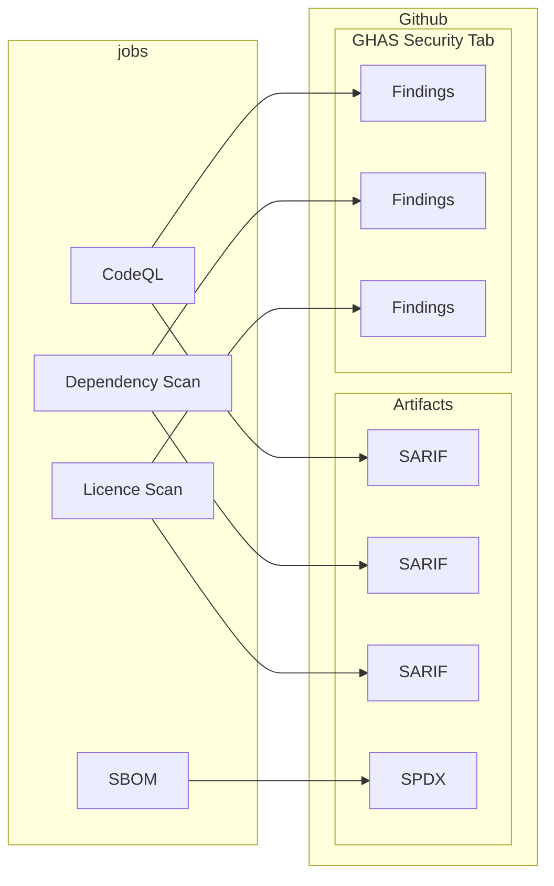

import Description from "@site/src/components/workflow/Description";
import Usage from "@site/src/components/workflow/Usage/Usage.mdx";
import Details from "@site/src/components/workflow/Details/Details.mdx";
import ScreenShots from "@site/src/components/ScreenShots";

# NodeJS Security

{/* AUTOGENERATED: Description component with badge for lifecycle status */}

<Description
  status={frontMatter.status}
  description={frontMatter.description}
  tags={frontMatter.tags}
/>

<ScreenShots screenshots={frontMatter.screenshots} />

## Purpose

:::info

This workflow is similar to the [node-tests](../node-tests) workflow. The `node-tests` workflow can
be considered as soft-deprecated in favour of this one.

The `node-tests` workflow was too mixed in its purpose and is completely replaced (and extended) by
this `node-security` workflow along with a dedicated `node-quality` workflow.

:::

This workflow is for node projects that need to scan dependencies for vulnerabilities and licenses
that are not allowed by OSPO.

It will also run CodeQL as a SAST tool and produce a Software Bill of Materials (SBOM).

All jobs are integrated with GitHub Advanced Security (GHAS) and will produce findings in the
Security tab of your repository.

{/* AUTOGENERATED: Component generating minimal example and input / secret / output lists */}

<Usage workflow={frontMatter.workflow} version={frontMatter.version} />

## Configuration Notes

:::info

The workflow itself will not provide the scripts and dependencies. It simply executes your commands
and provide artifacts if the appropriate dependencies are installed and configured.

:::

### Build authentication

Secrets are provided for build-time authentication with private package registries such as
Artifactory, NPM etc.

There are options to provide an `auth-token` and/or `auth-token-2` where the environment variable
they are exposed as is configurable.

For example you could expose `auth-token: NPM_TOKEN=${{ secrets.SOME_SECRET }}` or
`auth-token: ARTIFACTORY_AUTH_TOKEN=${{ secrets.SOME_SECRET }}` depending on what your build process
requires.

## Additional Examples

### Disable specific jobs

For example, to disable the licence scanning job:

```yaml
node-security:
  uses: ingka-group-digital/workflows/.github/workflows/node-security.yml@v2
  with:
    licence-enable: false
```

### Custom commands and auth tokens

Most relevant commands are customisable, even with multiple commands using the `|` syntax. You can
pass in any environment variables you need to the commands for authentication with private package
registries.

```yaml
node-security:
  uses: ingka-group-digital/workflows/.github/workflows/node-security.yml@v2
  with:
    install-command: |
      cp .env.example .env
      npm ci
  secrets:
    auth-token: "NPM_TOKEN=${{ secrets.GH_NPM_AUTH_TOKEN }}"
    auth-token-2: "ARTIFACTORY_AUTH_TOKEN=${{ secrets.ARTIFACTORY_AUTH_TOKEN }}"
```

{/* AUTOGENERATED: Component producing the job / step lists plus source code block */}

<Details workflow={frontMatter.workflow} configs={frontMatter.configs} />

## Diagram


